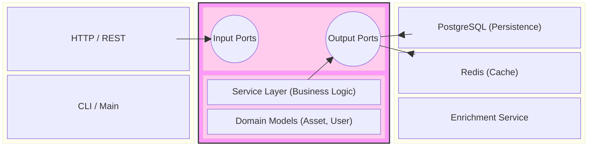
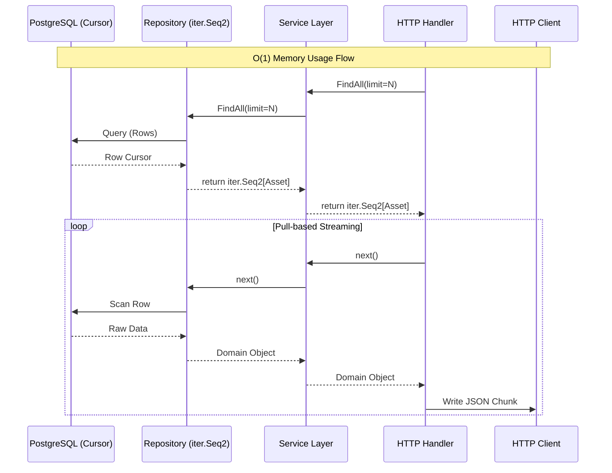
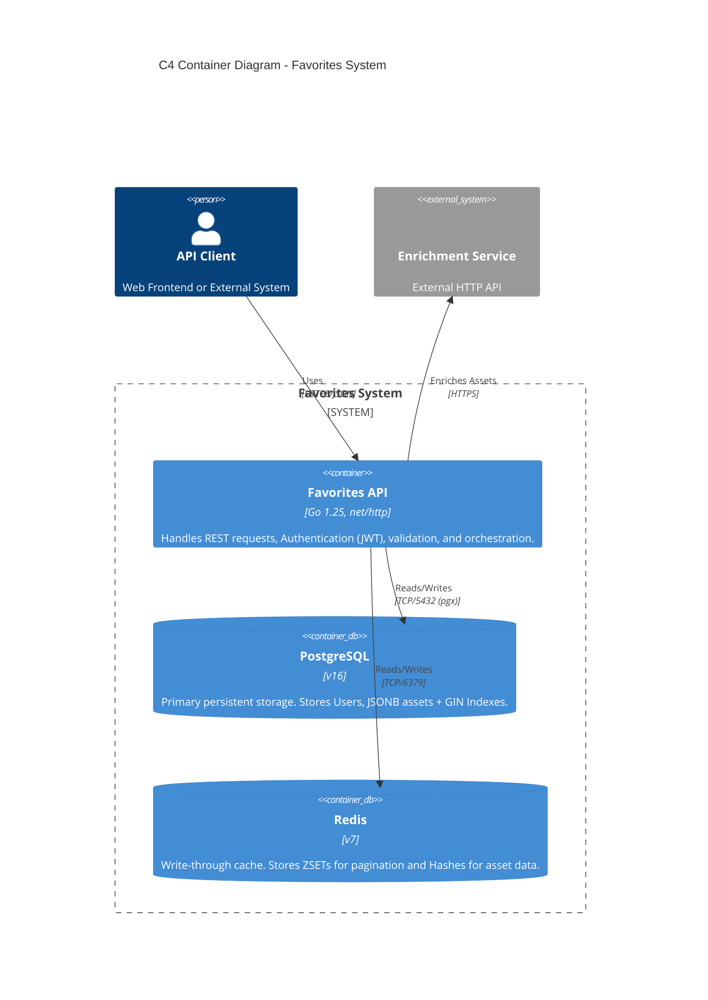
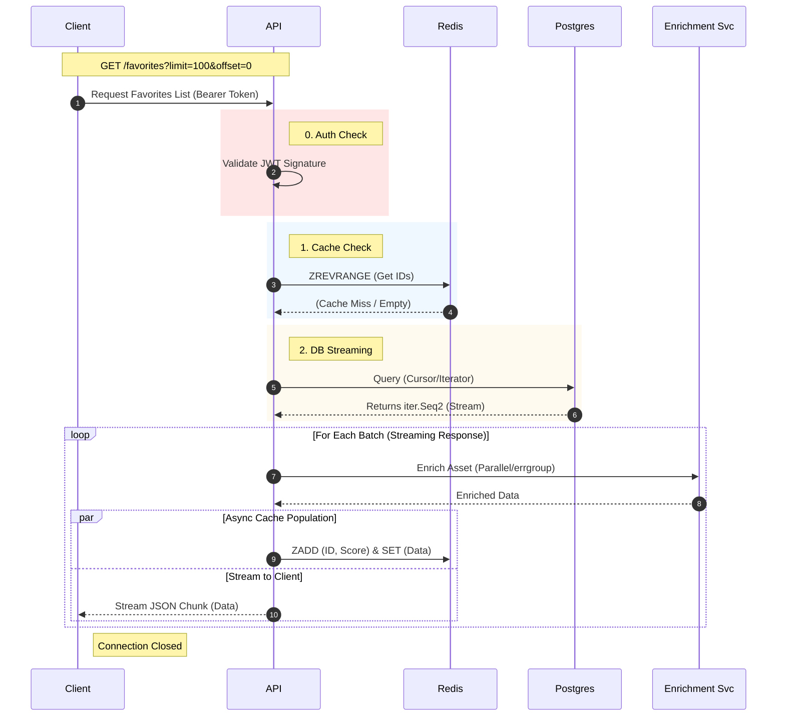

# System Architecture

This document details the architectural design decisions, patterns, and structure of the Favorites Service.

## Architectural Pattern: Hexagonal Architecture (Ports & Adapters)

The application follows the **Hexagonal Architecture** pattern (also known as Ports & Adapters) to ensure separation of concerns and testability.

* **Core (`internal/core`)**: Contains the pure business logic and domain entities. It has **zero dependencies** on frameworks, databases, or HTTP.
* **Ports (`internal/core/ports`)**: Interfaces that define how data enters and leaves the core. This is the boundary of the hexagon.
* **Adapters (`internal/adapter`)**: Implementations of the ports (e.g., `pgx` for Postgres, `net/http` for REST).

This structure allows us to swap the database, cache, or transport layer without touching the business logic.

## Zero-Allocation Streaming Pattern

To satisfy the requirement of "unlimited favorites" without crashing memory (OOM), we utilize **Go 1.25 Iterators (`iter.Seq2`)**.

### Data Flow

### Explanation

1. **Cursor-Based Query**: The Database Adapter acts as a cursor. It does not load all rows into a slice.
2. **Iterator Yielding**: The Repository layer converts SQL rows into domain objects one by one, yielding them to the Service layer via `iter.Seq2[domain.Asset, error]`.
3. **HTTP Streaming**: The HTTP Handler loops over this iterator. For each item, it marshals it to JSON and writes it immediately to the `http.ResponseWriter`.

**Result:** Memory usage remains flat (approx. size of 1 Asset + Buffer) regardless of whether the user has 100 or 1,000,000 favorites.

## Container Diagram (C4)

The system is composed of a core Go REST API, backed by PostgreSQL for persistence and Redis for high-speed caching and sorting. It interacts with an external Enrichment Service to hydrate asset data.

## Request Flow: Get Favorites (Async Write-Through)

This sequence diagram illustrates the **Async Write-Through** pattern used to decouple write performance from read performance.

